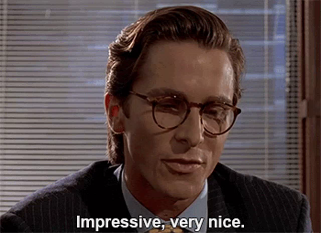

Дейнека Олег Николаевич

WEB-РАЗРАБОТЧИК / HTML-ВЕРСТАЛЬЩИК / ПРОГРАММИСТ PHP / JAVASCRIPT

Доброго времени суток.
Я занимаюсь web-разработкой с нуля, под ключ.
Выполняю верстку и программирование сайтов, а так же доработку, добавляя полный функционал на сайт! Верстаю адаптивную верстку с помощью Bootstrap, 
таким образом сайт получается красивым на любом устройстве, будь то комьютер, ноутбук или телефон!

Знаю такие языки программирования, как: PHP, JavaScript. Языки разметки: HTML(5), таблицы стилей CSS(3).
Умею верстать адаптивные сайты под планшеты и мобильные устройства, фраемворк Bootstrap. Также знаю библиотеку jQuery!

По вопросам сотрудничества обращайтесь по электронной почте:

elegy.pudge@gmail.com

